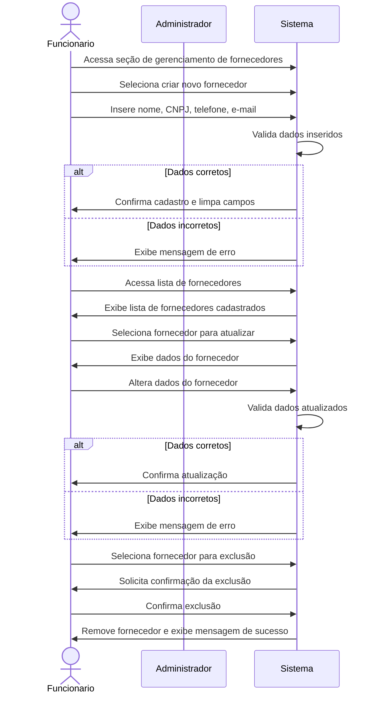

# Diagramas de Sequência

## Cadastro de Fornecedores (RF1)

```mermaid
sequenceDiagram
    actor Funcionario
    participant Administrador
    participant Sistema

    Funcionario->>Sistema: Acessa seção de gerenciamento de fornecedores
    Funcionario->>Sistema: Seleciona criar novo fornecedor
    Funcionario->>Sistema: Insere nome, CNPJ, telefone, e-mail
    Sistema->>Sistema: Valida dados inseridos
    alt Dados corretos
        Sistema->>Funcionario: Confirma cadastro e limpa campos
    else Dados incorretos
        Sistema->>Funcionario: Exibe mensagem de erro
    end

    Funcionario->>Sistema: Acessa lista de fornecedores
    Sistema->>Funcionario: Exibe lista de fornecedores cadastrados

    Funcionario->>Sistema: Seleciona fornecedor para atualizar
    Sistema->>Funcionario: Exibe dados do fornecedor
    Funcionario->>Sistema: Altera dados do fornecedor
    Sistema->>Sistema: Valida dados atualizados
    alt Dados corretos
        Sistema->>Funcionario: Confirma atualização
    else Dados incorretos
        Sistema->>Funcionario: Exibe mensagem de erro
    end

    Funcionario->>Sistema: Seleciona fornecedor para exclusão
    Sistema->>Funcionario: Solicita confirmação da exclusão
    Funcionario->>Sistema: Confirma exclusão
    Sistema->>Funcionario: Remove fornecedor e exibe mensagem de sucesso
```