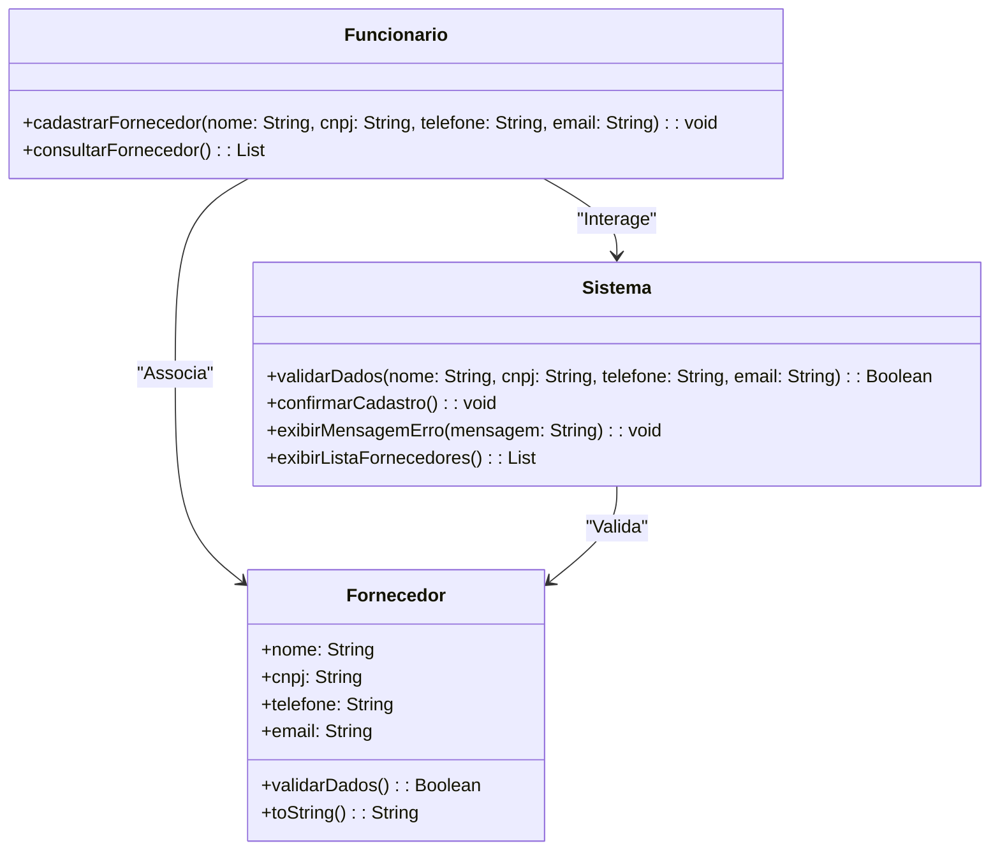

# Diagrama de Classes

## Diagrama de classes resultante dos diagramas de comunicação para as operações Cadastrar Fornecedor e Consultar Fornecedor

```mermaid
classDiagram
    class Fornecedor {
        +nome: String
        +cnpj: String
        +telefone: String
        +email: String
        +validarDados(): Boolean
        +toString(): String
    }

    class Funcionario {
        +cadastrarFornecedor(nome: String, cnpj: String, telefone: String, email: String): void
        +consultarFornecedor(): List<Fornecedor>
    }

    class Sistema {
        +validarDados(nome: String, cnpj: String, telefone: String, email: String): Boolean
        +confirmarCadastro(): void
        +exibirMensagemErro(mensagem: String): void
        +exibirListaFornecedores(): List<Fornecedor>
    }

    Funcionario --> Fornecedor : "Associa"
    Funcionario --> Sistema : "Interage"
    Sistema --> Fornecedor : "Valida"
```