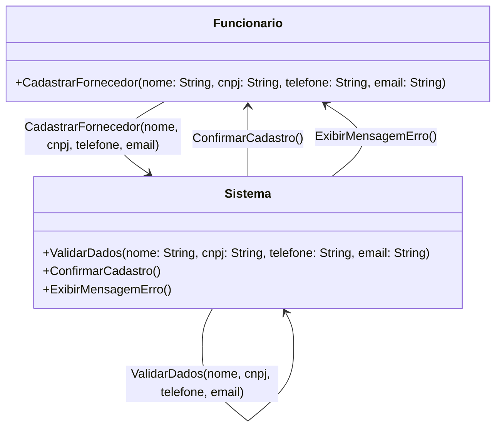
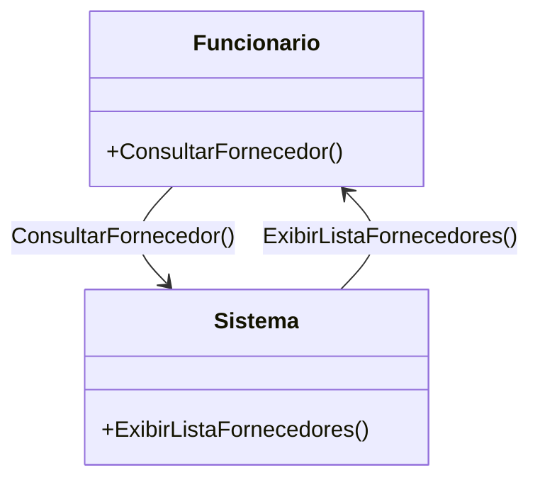

# Modelo Conceitual

## Diagrama de Comunicação: Cadastrar Fornecedor

```mermaid
classDiagram
    class Funcionario {
        +CadastrarFornecedor(nome: String, cnpj: String, telefone: String, email: String)
    }

    class Sistema {
        +ValidarDados(nome: String, cnpj: String, telefone: String, email: String)
        +ConfirmarCadastro()
        +ExibirMensagemErro()
    }

    Funcionario --> Sistema : CadastrarFornecedor(nome, cnpj, telefone, email)
    Sistema --> Sistema : ValidarDados(nome, cnpj, telefone, email)
    alt Dados corretos
        Sistema --> Funcionario : ConfirmarCadastro()
    else Dados incorretos
        Sistema --> Funcionario : ExibirMensagemErro()
    end
```

## Diagrama de Comunicação: Consultar Fornecedor

```mermaid
classDiagram
    class Funcionario {
        +ConsultarFornecedor()
    }

    class Sistema {
        +ExibirListaFornecedores()
    }

    Funcionario --> Sistema : ConsultarFornecedor()
    Sistema --> Funcionario : ExibirListaFornecedores()
```