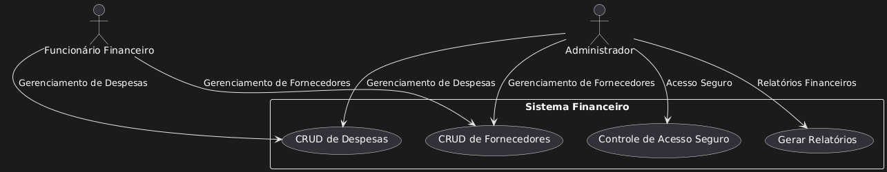

# Casos de Uso - Sistema Financeiro

## UC1: Gerenciamento de Fornecedores (CRUD de Fornecedores)
**Objetivo:** Permitir que os funcionários do setor financeiro e administradores possam adicionar, editar, visualizar e remover fornecedores no sistema.

**Atores:** Funcionário do setor financeiro, Administrador.

**Descrição:** Este caso de uso permite ao usuário gerenciar os fornecedores com informações como nome, CNPJ e contato, garantindo que todos os dados sejam acessíveis e atualizados conforme necessário.

**Cenário Principal:**
1. O usuário acessa o módulo de gerenciamento de fornecedores.
2. O sistema exibe a lista de fornecedores existentes.
3. O usuário escolhe uma das opções: criar, editar, visualizar ou excluir um fornecedor.
   - **3a. Criar fornecedor:** O usuário insere as informações necessárias (nome, CNPJ, telefone, e-mail) e confirma.
   - **3b. Editar fornecedor:** O usuário seleciona um fornecedor da lista, faz as alterações necessárias e confirma.
   - **3c. Visualizar fornecedor:** O usuário seleciona um fornecedor para visualizar os detalhes.
   - **3d. Excluir fornecedor:** O usuário escolhe um fornecedor e confirma a exclusão.
4. O sistema processa a solicitação e retorna uma mensagem de sucesso.

**Restrições e Requisitos:** 
- O sistema deve criptografar as informações dos fornecedores para garantir a segurança.
- O tempo de resposta para as operações de CRUD deve ser inferior a 2 segundos.

---

## UC2: Gerenciamento de Despesas (CRUD de Despesas)
**Objetivo:** Permitir que funcionários do setor financeiro e administradores registrem, editem, visualizem e excluam despesas no sistema.

**Atores:** Funcionário do setor financeiro, Administrador.

**Descrição:** Este caso de uso possibilita a gestão detalhada de despesas, permitindo ao usuário inserir dados como data, valor, categoria e fornecedor vinculado para cada despesa.

**Cenário Principal:**
1. O usuário acessa o módulo de gerenciamento de despesas.
2. O sistema exibe a lista de despesas cadastradas.
3. O usuário escolhe uma das opções: criar, editar, visualizar ou excluir uma despesa.
   - **3a. Criar despesa:** O usuário insere as informações (data, valor, categoria, fornecedor) e confirma.
   - **3b. Editar despesa:** O usuário seleciona uma despesa existente, faz as alterações e confirma.
   - **3c. Visualizar despesa:** O usuário seleciona uma despesa para ver os detalhes.
   - **3d. Excluir despesa:** O usuário escolhe uma despesa e confirma a exclusão.
4. O sistema confirma a operação e exibe uma mensagem de sucesso.

**Restrições e Requisitos:** 
- Garantir que as despesas estejam vinculadas aos fornecedores corretamente.
- O sistema deve manter a confiabilidade dos dados e a compatibilidade com os relatórios financeiros.

---

## UC3: Relatórios Financeiros
**Objetivo:** Gerar relatórios financeiros detalhados para análise de despesas e controle de fornecedores.

**Atores:** Administrador.

**Descrição:** O administrador pode visualizar relatórios detalhados sobre as despesas e fornecedores para controle financeiro e auditorias.

**Cenário Principal:**
1. O administrador acessa o módulo de relatórios.
2. Seleciona o tipo de relatório desejado (despesas, fornecedores ou ambos).
3. Define os filtros necessários (data, categoria, fornecedor).
4. O sistema processa e gera o relatório solicitado.
5. O administrador visualiza o relatório ou exporta-o em PDF.

**Requisitos Não Funcionais:**
- Garantir compatibilidade com os relatórios financeiros anuais.
- Sincronização dos relatórios com o histórico de despesas.

---

## UC4: Controle de Acesso Seguro
**Objetivo:** Restringir o acesso a dados financeiros confidenciais somente a usuários autorizados.

**Atores:** Administrador.

**Descrição:** O sistema deve permitir apenas aos administradores acesso completo às informações financeiras críticas, como relatórios e dados de fornecedores, através de autenticação segura.

**Cenário Principal:**
1. O usuário tenta acessar uma seção com dados financeiros sensíveis.
2. O sistema solicita autenticação avançada (login e senha segura).
3. Após a autenticação, o usuário autorizado pode visualizar ou manipular as informações.

**Restrições:** 
- Conformidade com a LGPD para a proteção de dados.
- Implementação de segurança para impedir acesso não autorizado.

